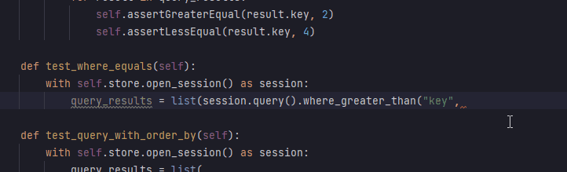
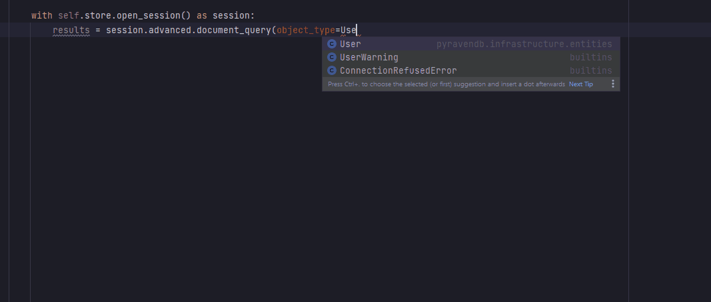

# Official Python client for RavenDB NoSQL Database 🐍

## Installation
Install from [PyPi](https://pypi.python.org/pypi), as [ravendb](https://pypi.org/project/ravendb/5.2.0b3/).
```bash
pip install ravendb==5.2.0b3
````
## Introduction and changelog
Python client API (v5.2) for [RavenDB](https://ravendb.net/) , a NoSQL document database.


Although new API isn't compatible with the previous one, it comes with **many improvements and new features**.

**Package has been reworked to match Java and other RavenDB clients**

**Type-hinted entire project and API results** - using the API is now much more comfortable with IntelliSense

---


---

## What's new?

###### 5.2.0b3
- **New features**
  - Conditional Load
  - SelectFields & Facets
  - Projections
  - MoreLikeThis
  - Suggestions


- **Improvements**
  - Compare exchange
  - Querying
  - DocumentConventions
  - Patching
  - Spatial queries
  - Aggregations


###### 5.2.0b2

- **Lazy Operations**
  - Lazy loading
  - Lazy querying
  - Lazy compare exchange operations


- **Structure**
  - Important classes are now available to import from the top level `ravendb` module

...and many bugfixes


---

###### 5.2.0b1

- **Querying** 
  - Simpler, well type hinted querying
  - Group by, aggregations
  - Spatial querying
  - Boost, fuzzy, proximity
  - Subclauses support
 
- **Static Indexes**
  - Store fields, index fields, pick analyzers & more using `AbstractIndexCreationTask`
  - Full indexes CRUD
  - Index related commands (priority, erros, start/stop, pause, lock)
  - Additional assemblies, map-reduce, index query with results "of_type" 
  
    
- **CRUD**
  - Type hints for results and includes
  - Support for dataclasses
 
----

#### Querying features


----

- **Attachments**
  - New attachments API
  - Better type hints 


- **HTTPS**
  - Support for https connection
  - Certificates CRUD operations


- **Lazy load**
  - New feature


- **Cluster Transactions, Compare Exchange**
  - New feature
  

### **Coming soon, work in progress**
  - Counters, Time Series
  - Streams and Subscriptions
  - Select fields
  - Task related commands (crud for replication, subscriptions, etl) + connection strings


The client is still in the **beta** phase.

----
### Demo

##### Working with secured server
```python
from ravendb import DocumentStore

URLS = ["https://raven.server.url"]
DB_NAME = "SecuredDemo"
CERT_PATH = "path\\to\\cert.pem"


class User:
    def __init__(self, name: str, tag: str):
        self.name = name
        self.tag = tag


store = DocumentStore(URLS, DB_NAME)
store.certificate_pem_path = CERT_PATH
store.initialize()
user = User("Gracjan", "Admin")

with store.open_session() as session:
    session.store(user, "users/1")
    session.save_changes()

with store.open_session() as session:
    user = session.load("users/1", User)
    assert user.name == "Gracjan"
    assert user.tag == "Admin"
```

---

#### RavenDB Documentation
https://ravendb.net/docs/article-page/5.3/python

-----
##### Bug Tracker
http://issues.hibernatingrhinos.com/issues/RDBC
